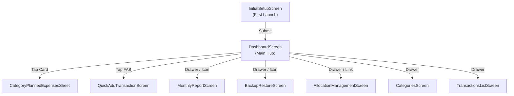

# Aloca Master Figma Specification & Code-to-Canvas Guide

**Phase 1 Specification — Version 1.0.0**  
*Source Code Baseline: Aloca Flutter Mobile Application*

---

## 1. Design Overview

Aloca is a local-first personal financial allocation mobile application engineered around the **Plan → Allocate → Track** methodology.

* **Target Device Viewport**: `390 x 844 dp` (iPhone 14/15 / Android Mobile Standard)
* **Primary Palette**: Emerald Teal (`#00A884`), Slate Dark (`#0F172A`), Page Background (`#F8FAFC`)
* **Primary Font**: `Roboto`
* **Card Style**: Flat surface white cards with `16dp` corner radius and subtle `4% opacity` drop shadow

---

## 2. Foundations

### 🎨 Colors

```text
Primary / Brand:
  - Brand Seed: #00A884 (Color(0xFF00A884))
  - Brand Dark: #008B74 (Color(0xFF008B74))
  - Brand Tint: #00A8841A (Color(0x1A00A884))

Backgrounds & Surfaces:
  - Page Background: #F8FAFC (Color(0xFFF8FAFC))
  - Surface White: #FFFFFF (Colors.white)
  - Card Sub-surface: #F8FAFC (Color(0xFFF8FAFC))
  - Input Fill: #F8FAFC / #F1F5F9 (Color(0xFFF8FAFC) / Color(0xFFF1F5F9))
  - Divider / Border: #E2E8F0 (Colors.grey.shade300)

Text Hierarchy:
  - Text Primary: #0F172A (Color(0xFF0F172A))
  - Text Secondary: #64748B (Color(0xFF64748B))
  - Text Muted: #94A3B8 (Color(0xFF94A3B8))
  - Text Inverse: #FFFFFF (Colors.white)

Semantics & Feedback:
  - Expense / Error: #EF4444 / #DC2626
  - Expense Tint: #FEF2F2 / #FCE8E6
  - Income / Success: #10B981
  - Success Tint: #DCFCE7 / #F0FDF4
  - Warning / Overrun: #F59E0B / #D97706
  - Warning Tint: #FEF3C7 / #FFFBEB
  - Info / Allocated: #3B82F6 / #2563EB
  - Info Tint: #EFF6FF / #E8F0FE
```

### 🔤 Typography

```text
Display & Heroes:
  - Display Large: Roboto Bold 24sp (#0F172A / #FFFFFF)
  - Display Medium: Roboto Bold 22sp (#FFFFFF)
  - Display Small: Roboto Semi-bold 20sp (#FFFFFF / #0F172A)

Headings & Titles:
  - Heading Large: Roboto Bold 20sp (#0F172A)
  - Heading Medium: Roboto Bold 18sp (#0F172A)
  - Heading Small: Roboto Bold/Semi-bold 16sp (#0F172A)

Body & Labels:
  - Section Title: Roboto Bold 15sp (#1E293B)
  - Body Primary: Roboto Bold/Regular 14sp (#0F172A)
  - Body Secondary: Roboto Semi-bold/Regular 13sp (#64748B / #00A884)
  - Label Standard: Roboto Semi-bold/Regular 12sp (#64748B)
  - Label Small: Roboto Semi-bold/Regular 11sp (#64748B)
  - Caption / Badge: Roboto Medium 10sp (#137333 / #1A73E8 / #C5221F)
```

### 📏 Spacing Scale
`2dp`, `4dp`, `6dp`, `8dp`, `10dp`, `12dp`, `14dp`, `16dp` (Default Screen Outer Padding), `20dp`, `24dp`, `32dp`, `48dp/50dp/52dp` (CTA Button Heights), `80dp` (Bottom FAB Clearance).

### 📐 Corner Radius
- CustomCard: `16dp`
- Modal Bottom Sheets (Top): `20dp` / `24dp`
- Text Inputs / Buttons: `12dp`
- Tab / Choice Chips: `10dp` / `12dp`
- Badges: `6dp`
- Drag Handle: `2dp` (Height 4dp, Width 40dp)

### ☀️ Elevation & Shadows
- Cards: `BoxShadow(color: #0000000A, blurRadius: 10, offset: (0, 4))`
- AppBars: `0` (Flat white)

---

## 3. Core Components

1. **`CustomCard`**: Baseline container card (`#FFFFFF`, Radius 16dp, 4% Opacity Shadow).
2. **`CustomProgressBar`**: Pill progress track (`height 6dp/8dp`, background `color 15% opacity`, fill `color 100% opacity`).
3. **`StatusBadge`**: Compact category status badge (Under Budget `#E6F4EA`, On Budget `#E8F0FE`, Over Budget `#FCE8E6`).
4. **`Buttons`**:
   - Primary CTA: Height 48-52dp, Teal `#00A884` / Red `#EF4444`, Radius 12dp.
   - Secondary Outlined: Blue `#3B82F6` / Teal `#00A884`, Radius 12dp.
5. **`TextField`**: Filled `#F8FAFC`, Radius 12dp, dynamic IDR currency formatter.
6. **`Segmented Chips`**: ChoiceChips for method selection, tab selection, and type selection.

---

## 4. Financial Components

1. **Financial Position Summary Card**: Teal gradient banner (`#00A884` -> `#008B74`), mask eye toggle button, 2x2 stats grid.
2. **Warning Banners**: Unallocated funds alert (`#EFF6FF`), Overallocated alert (`#FEF2F2`).
3. **Category Progress Card**: Color dot indicator, progress bar, Terpakai vs Sisa amounts, Planned Expenses status badge.
4. **Planned Expense Item Tile**: 1-Tap Pay checkbox, title, sub-info, nominal, overrun status badge.

---

## 5. Screen Layout Specifications

The app consists of 9 user-facing screens and sheets:
1. `InitialSetupScreen` (Onboarding)
2. `DashboardScreen` (Main Hub)
3. `CategoryPlannedExpensesSheet` (Modal Sheet)
4. `QuickAddTransactionScreen` (Modal Sheet)
5. `TransactionsListScreen` (History & Filters)
6. `AllocationManagementScreen` (2-Pass Allocation Editor)
7. `CategoriesScreen` (Dynamic Category Management)
8. `BackupRestoreScreen` (8-Sheet Excel Export/Import)
9. `MonthlyReportScreen` (Variance Table & Financial Position)

---

## 6. Navigation Architecture



---

## 7. Interaction States

- **Default / Enabled**: Clean `#F8FAFC` background, clear typography, unselected chips.
- **Pressed / Ripple**: Material InkWell splash feedback over transparent wrapper.
- **Selected**: Filled Teal `#00A884` / Expense Red `#EF4444` background.
- **Masked Balance Mode**: Balance displayed as `"Rp ••••••••"`.
- **Item Paid State**: Light green tile `#F0FDF4` with checkmark icon and green text.
- **Item Overrun State**: Light green tile with amber warning badge `"Dibayar di atas rencana (+Rp X)"`.

---

## 8. Visual Inconsistencies Log

1. **Button Heights**: Onboarding `52dp`, Allocation `50dp`, Quick Add `48dp`.
2. **Modal Sheet Corner Radii**: Category/Edit Sheet `20dp`, Quick Add Sheet `24dp`.
3. **Modal Sheet Horizontal Padding**: Category Sheet `16dp`, Quick Add/Edit Sheet `20dp`.
4. **Section Header Font Sizes**: Dashboard/Category Sheet `15sp`, Allocation/Report `16sp`.

---

## 9. Code-to-Canvas Readiness

* **Status**: **READY**
* **Screens Representable**: 9/9 (100%)
* **Components Representable**: All shared widgets & patterns documented.
* **Blockers**: None.
* **Recommended Figma Hierarchy**:
  ```text
  Aloca System
  ├── Foundations (Colors, Typography, Spacing, Radius, Elevation)
  ├── Components (Buttons, Inputs, Cards, Badges, ProgressBars)
  ├── Financial UI (PositionBanner, CategoryCards, PlannedTiles)
  └── Screens (Dashboard, Allocation, Transactions, Categories, Backup, Report, Setup)
  ```
