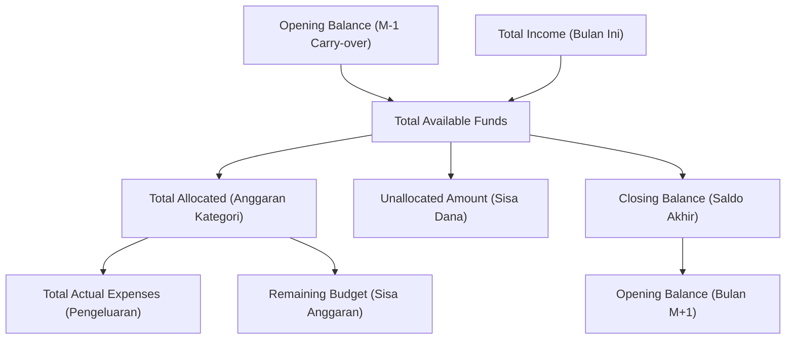

# Financial UI Analysis

This document details how Aloca's core financial allocation concepts (*Plan → Allocate → Track*) are visually represented across the application.

---

## 💵 Core Financial Concepts & Visual Hierarchy

---

## 📋 Financial Concepts Specification Table

| Financial Concept | Formula / Meaning | Visual Treatment | Color Code | Typography | Target Components & Screens |
| :--- | :--- | :--- | :--- | :--- | :--- |
| **Opening Balance** | Saldo bawaan dari Closing Balance bulan sebelumnya ($M-1$) | Text row in Financial Position card & report | White / `#0F172A` | `11sp` / `13sp` Regular | `DashboardScreen`, `InitialSetupScreen`, `MonthlyReportScreen` |
| **Income / Total Income** | Pemasukan baru pada bulan berjalan | Row text with `+` prefix, green indicator | `#10B981` (Green) | `11sp` / `13sp` / `14sp` Bold | `DashboardScreen`, `TransactionsListScreen`, `MonthlyReportScreen` |
| **Total Available** | `Opening Balance + Total Income` | **Hero Banner Amount**, main title in Financial Position card | `#FFFFFF` on Teal Gradient (`#00A884`) | `20sp` / `22sp` Bold | `DashboardScreen`, `AllocationManagementScreen`, `MonthlyReportScreen` |
| **Total Allocated** | Sum of all category allocations (Fixed + % + Sisa) | Stat grid item, text indicator | `#3B82F6` (Blue) | `12sp` / `13sp` Semi-bold | `DashboardScreen`, `AllocationManagementScreen` |
| **Unallocated Amount** | `Total Available - Total Allocated` | Warning banner (Blue if > 0, Red if < 0) | `#1E40AF` / `#991B1B` | `12sp` Regular / Semi-bold | `DashboardScreen`, `AllocationManagementScreen` |
| **Actual Expenses** | Sum of all expense transactions in period | Stat grid item, list item with `-` prefix, progress bar fill | `#EF4444` (Red) | `13sp` / `14sp` Bold | `DashboardScreen`, `CategoryPlannedExpensesSheet`, `TransactionsListScreen` |
| **Remaining Budget** | `Allocated - Actual Expenses` per category | Stat text, category progress footer text | `#10B981` (Green if >= 0), `#EF4444` (Red if < 0) | `11sp` / `12sp` Bold | `DashboardScreen`, `CategoryPlannedExpensesSheet`, `MonthlyReportScreen` |
| **Over Budget / Overrun** | `Actual Expenses > Allocated Amount` | Red progress bar fill, `StatusBadge` ('Over Budget'), orange overrun tag | `#C5221F` / `#F59E0B` | `10sp` Badge, `11sp` Helper | `StatusBadge`, `CategoryPlannedExpensesSheet`, `DashboardScreen` |
| **Closing Balance** | `Total Available - Total Actual Expenses` | Stat grid item, final summary row in report | `#0F172A` / `#00A884` | `13sp` Bold | `DashboardScreen`, `MonthlyReportScreen` |
| **Continuous Carry-over** | $\text{Opening}_M = \text{Closing}_{M-1}$ | Handled automatically; displayed as Opening Balance | `#FFFFFF` / `#0F172A` | `11sp` / `13sp` Regular | `MonthlyReportScreen`, `DashboardScreen` |
